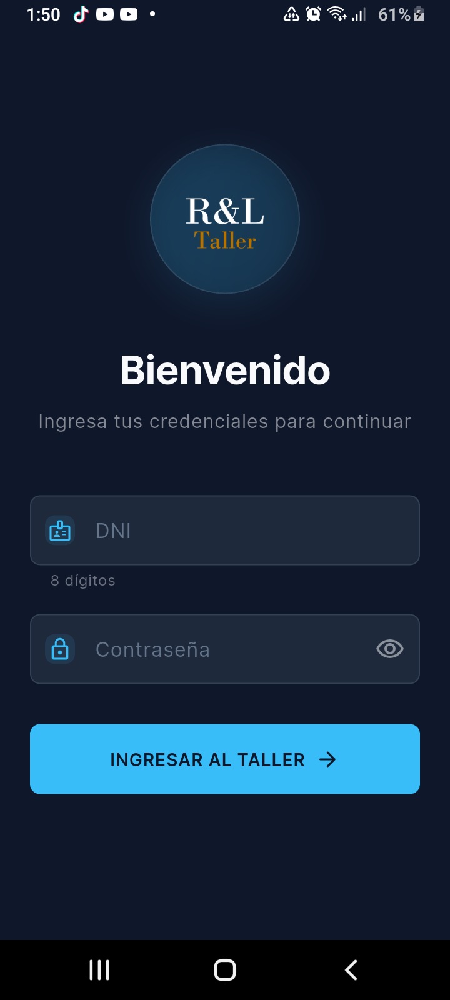
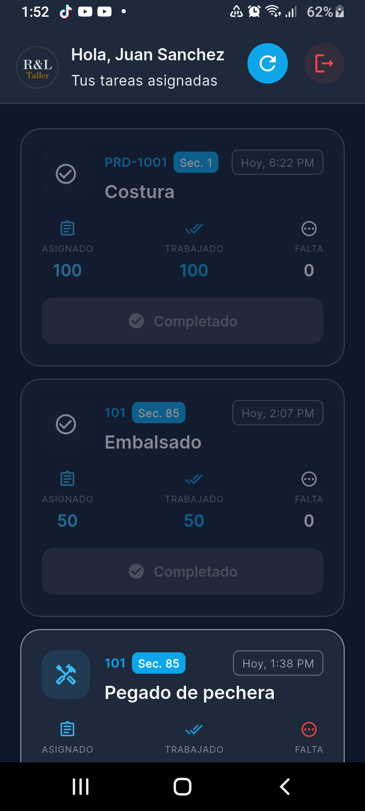
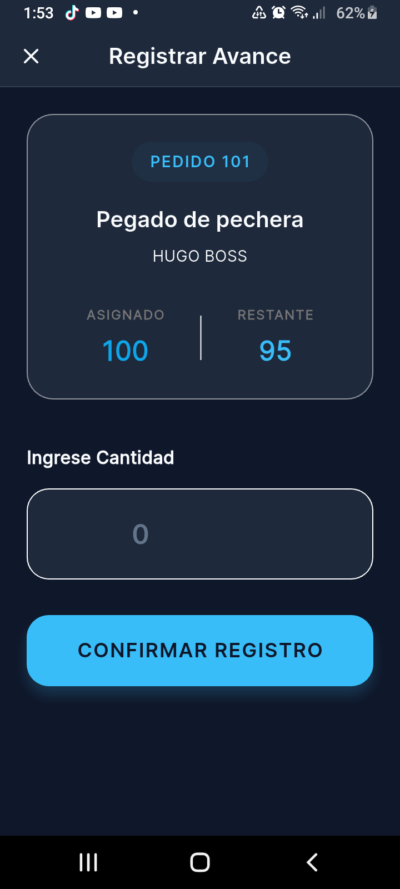
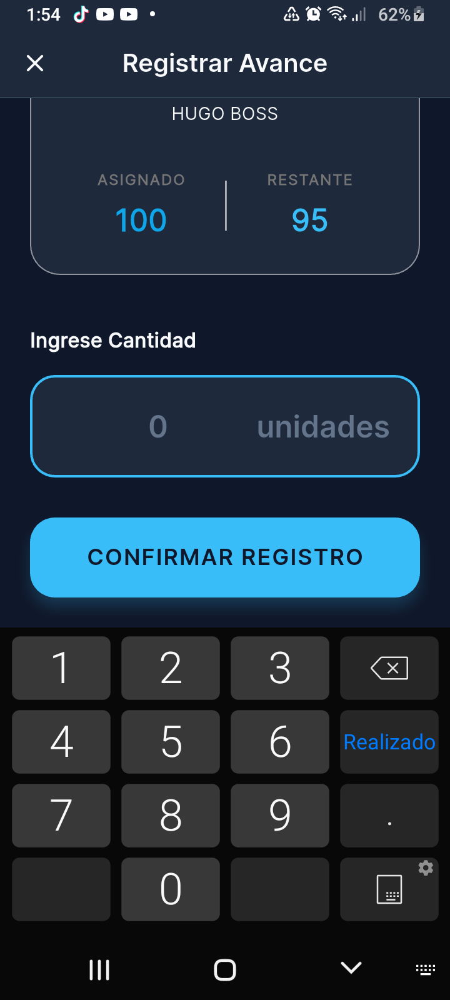
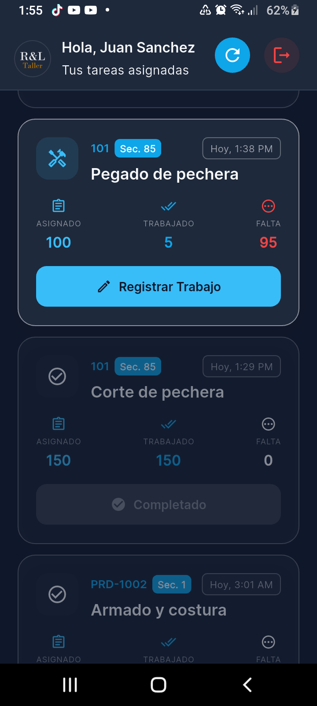

# 📱 App Taller RL

**Sistema de Gestión y Control de Producción en Planta**

> Una aplicación móvil desarrollada en **Flutter** para optimizar el flujo de trabajo en talleres de confección y manufactura. Permite a los operarios visualizar sus tareas asignadas y registrar su avance en tiempo real.

---

## ✨ Características Principales

Esta aplicación está diseñada para ser intuitiva y eficiente para el personal de planta:

*   **🔐 Autenticación Segura**: Acceso mediante credenciales de usuario (DNI/Contraseña).
*   **📋 Gestión de Tareas**: Visualización clara de las operaciones asignadas (Pedidos, Secuencia, Operación).
*   **📊 Seguimiento de Progreso**:
    *   Indicadores visuales de avance (Asignado vs. Trabajado).
    *   Estado de las tareas: *Pendiente*, *En Proceso* y *Completado*.
    *   Tarjetas con codificación de colores para fácil identificación.
*   **📝 Registro de Trabajo**:
    *   Interfaz simplificada para ingresar cantidades producidas.
    *   Validaciones automáticas para evitar errores (no exceder cantidad asignada).
    *   Cálculo automático de faltantes.
*   **📅 Historial Dinámico**: Fechas con formato amigable (ej. "Hoy", "Ayer", "Hace 2 días").

---

## 🛠️ Tecnologías Utilizadas

El proyecto está construido utilizando prácticas modernas de desarrollo móvil:

*   **[Flutter](https://flutter.dev/)**: Framework UI de Google.
*   **[Dart](https://dart.dev/)**: Lenguaje de programación.
*   **Provider**: Gestión de estado eficiente y escalable.
*   **Material Design 3**: UI moderna, limpia y adaptable.
*   **Animate Do**: Animaciones fluidas para mejorar la experiencia de usuario.

---

## � Descarga la App

¡Descarga la última versión de la aplicación y comienza a usarla ahora mismo!


> **Nota**: Asegúrate de habilitar "Instalar de orígenes desconocidos" en tu dispositivo Android si es necesario.

---

## 📅 Historial de Actualizaciones

| Versión | Fecha | Cambios Principales | Descarga |
|:---:|:---:|:---|:---:|
| **v1.0.0** | 26/12/2024 | • Lanzamiento inicial<br>• Gestión de Pedidos y Operaciones<br>• Registro de Avance<br>• Modo Oscuro/Claro | [Descargar APK (Arm64)](./releases/app-release-v1.0.0.apk) |


---

## �📸 Capturas de Pantalla

Las imágenes se encuentran en la carpeta `screenshots/`.

| Login | Home | Registro |
|:---:|:---:|:---:|
|  |  |  |
| Acceso Seguro | Pantalla Principal | Registro de Avance |

| Datos Detallados | Listado de Tareas |
|:---:|:---:|
|  |  |
| Información de Usuario | Historial y Estado |

---

## 📂 Estructura del Proyecto

El código está organizado siguiendo una arquitectura limpia para facilitar el mantenimiento:

```
lib/
├── models/         # Modelos de datos (Asignacion, Usuario, etc.)
├── providers/      # Lógica de negocio y estado (AppProvider)
├── services/       # Comunicación con Backend/Base de Datos (DataService)
├── theme/          # Configuración de estilos y colores
├── views/          # Pantallas de la aplicación (UI)
│   ├── home_screen.dart          # Lista de tareas
│   ├── work_register_screen.dart # Formulario de registro
│   └── login_screen.dart         # Inicio de sesión
└── widgets/        # Componentes reutilizables (Cards, Inputs, etc.)
```

---

## 🚀 Instalación y Despliegue

Sigue estos pasos para ejecutar el proyecto en tu entorno local:

1.  **Clonar el repositorio**:
    ```bash
    git clone <url-del-repositorio>
    cd app_taller_rl
    ```

2.  **Instalar dependencias**:
    ```bash
    flutter pub get
    ```

3.  **Configurar entorno**:
    Asegúrate de tener un dispositivo conectado o un emulador de Android/iOS corriendo.

4.  **Ejecutar la App**:
    ```bash
    flutter run
    ```

---

## 🤝 Contribución

Si deseas contribuir a este proyecto:

1.  Haz un *Fork* del repositorio.
2.  Crea una rama para tu funcionalidad (`git checkout -b feature/NuevaFuncionalidad`).
3.  Haz *Commit* de tus cambios (`git commit -m 'Añadir nueva funcionalidad'`).
4.  Haz *Push* a la rama (`git push origin feature/NuevaFuncionalidad`).
5.  Abre un *Pull Request*.

---

Desarrollado con ❤️ para optimizar la producción.
